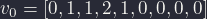
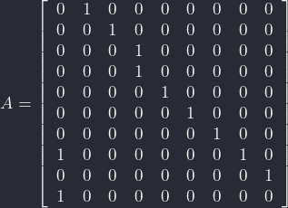
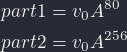

# Advent of Code 2021

This year I will try to solve the challenges using Common Lisp.

Some interesting solutions follow:

## Day 6: Laternfish

The problem describes a school of Lanternfish that each day grows in size with discrete steps where each fish of a certain age spawns to produce a single new fish.

To simplify the problem statement, we can group the individual fishes by their spawn timers.  9 possible values exists and so the problem can be modeled as a vector of 9 integers where each integer at index `i` represents the number of fish with the timer value of `i`.

Each day, we do the following:

1. Shift the vector one place to the left.
2. The number that was original at the first place is no longer in the vector.  Push it back to the last place and also add it to the value at the 6th place

Iterating these steps for 80 or 256 days and then summing all the numbers in the vector will produce the solution.

In Common Lisp, we can produce cyclic lists by point the `cdr` of the last `cons` cell of a list to the first `cons` cell of the list

```lisp
> (let ((counts (list 0 1 1 2 1 0 0 0 0)))
      (setf (cdr (last counts)) counts))
(0 1 1 2 1 0 0 0 0 0 1 1 2 1 0 0 0 0 0 1 1 2 1 0 0 0 0 0 1 1 2 1 0 0 0 0 0 1 1
 2 1 0 0 0 0 0 1 1 2 1 0 0 0 0 0 1 1 2 1 0 0 0 0 0 1 1 2 1 0 0 0 0 0 1 1 2 1 0
 ...)
```
The implementation rotates this sequence by simply updating the reference to the next `cons` in the list.

```lisp
(setf counts (cdr counts))
```

### the Matrix and the Fish

Using a single vector is quite a straightforward approach to this problem, but there is a nicer one that can be expressed in linear algebra.  It works as follows.

- We express the initial timer count as a vector (like we did in the straightforward solution): 



- We express the daily change in the form of a matrix.  This matrix is similar to the `9x9` identity matrix but is shifted by one row to reflect the daily timer update.  Also, the cell at `0,6` is set to 1 to show that fishes with a timer of `0` are added to the value at position `6`.



- With those constants, we define the solution as the product of the vector and the matrix raised to some power:



We can use some tricks to speed up the matrix exponentiation, but as I've not been able to find a matrix package that supports integer values, this nicer approach is slower than the earlier implementation.
